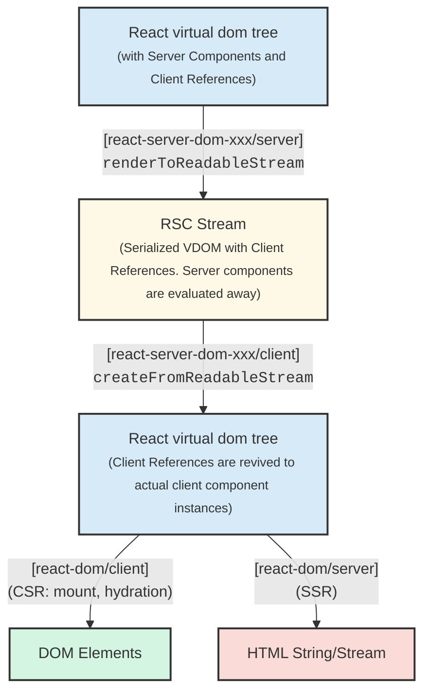
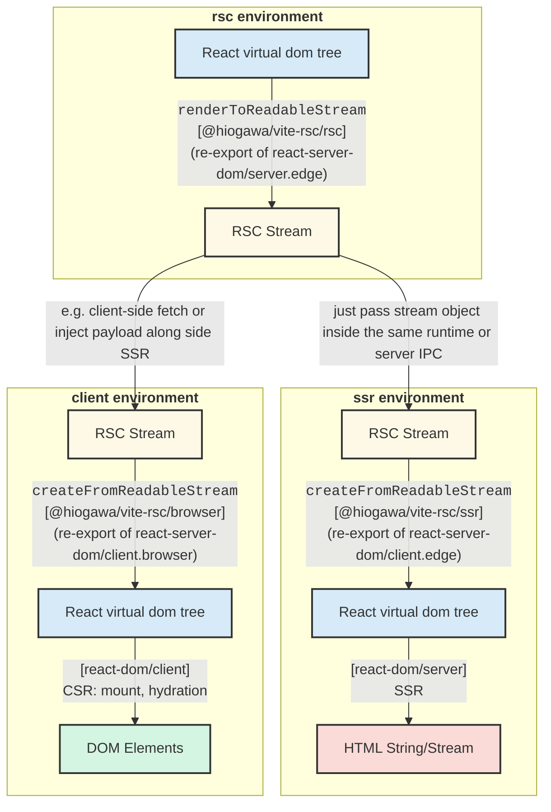
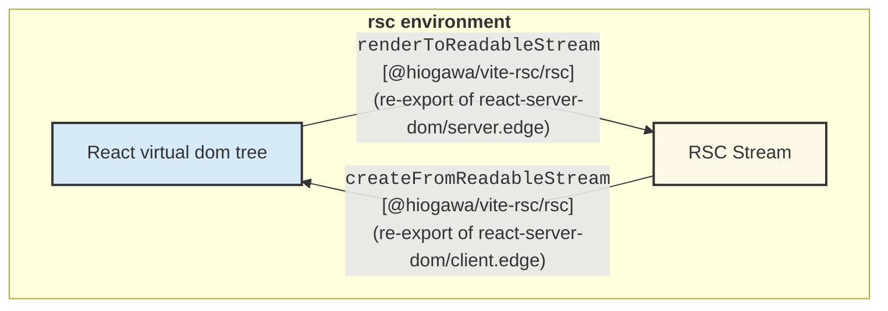

## basic flow

cf. https://github.com/reactwg/server-components/discussions/4

## Basic flow separated by environments

This illustrates `ssr` environment is technically an optional mechanism.

`rsc` environment can serialize and deserialize within itself

